# Обзор игровых скриптов

```mermaid
flowchart TD
    subgraph "Игровой цикл"
        GD[GameDirector]
        GCO[GameCycleOrchestrator]
        DNS[DayNightSystem]
        DC[DayCounter]
        ST[StaminaSystem]
    end
    subgraph "Экономика и контракты"
        WAL[Wallet]
        CS[ContractSystem]
        CPC[ContractPanelController]
        CV[ContractView]
    end
    subgraph "Постройки"
        BO[BuildingsOrchestrator]
        BS[BuildingService]
        BD[BuildingData & BuildingProgress]
        BLD[Builder & BuildingView]
        RTP[ResourceTransferController]
    end
    subgraph "Инвентарь и крафт"
        SB[ServiceBase]
        IS[InventoryService]
        CHS[ChestService]
        CCS[CraftCellService]
        CRF[CraftService]
        DDO[DragDropOrchestrator + UI]
    end
    subgraph "Поселенцы"
        NPS[NpcSystem]
        NS[NpcService]
        NM[NpcManager]
        MP[ManageBoard & Panel]
    end
    subgraph "Добыча ресурсов"
        MS[MiningSystem]
        RN[ResourceNode]
        EIV[ExtractedItemView]
    end
    subgraph "Бой"
        EO[EnemyOrchestrator]
        WS[WaveService]
        EM[EnemyManager]
        BE[BaseEnemy & подклассы]
        ATA[ArcherTowerAttack]
    end
    subgraph "Игрок и взаимодействия"
        PO[PlayerOrchestrator]
        PMV[PlayerMovement & PlayerView]
        PI[PlayerInteraction]
        BIO[BaseInteractableObject + наследники]
        RTI[TransferItem]
    end
    subgraph "Мир и визуал"
        SVC[SpriteViewController]
        SD[SpriteDimmer]
        CLD[CloudManager & Cloud]
        TREE[TreeView & StiveView]
    end

    GD --> GCO
    GCO --> DNS
    GCO --> ST
    GCO --> NPS
    GCO --> CS
    GCO --> EO
    GCO --> MS
    EO --> WS
    EO --> EM
    BO --> BS
    BO --> IS
    BO --> RTP
    CS --> CPC
    CPC --> CV
    CRF --> CCS
    DDO --> CCS
    DDO --> CRF
    NPS --> NM
    NPS --> MP
    NM --> MS
    MS --> IS
    MS --> CHS
    PO --> PI
    PI --> BIO
    PO --> PMV
    BIO --> RTP
    DNS --> SD
    SVC --> TREE
    SVC --> CLD
```

## Краткие описания систем
- **Игровой цикл.** `GameDirector` запускает подготовку волн и дневной цикл, который координирует `GameCycleOrchestrator`, распределяя действия между системами дня/ночи, поселенцами, контрактами, выносливостью и врагами, а также информируя интерфейс счётчика дней через событие `DayCounterChange` и зависимость от `DayCounter`. Используется паттерн «оркестратор» с событийной моделью.
- **Экономика и контракты.** `ContractSystem` генерирует заказы на основе числа поселенцев, проверяет наличие ресурсов в инвентаре и перечисляет награду в `Wallet`, а UI (`ContractPanelController` и `ContractView`) реагирует на обновления. Паттерн «сервис + наблюдатель» обеспечивает синхронизацию данных и представления.
- **Постройки.** Сервис `BuildingService` хранит состояние построек, а `BuildingsOrchestrator` асинхронно переносит ресурсы из инвентаря через `ResourceTransferController`, обновляя `BuildingProgress`, UI панели требований и состояние `Builder`/`BuildingView`. Шаблонные сервисы и события уведомляют подписчиков о прогрессе.
- **Инвентарь и крафт.** Базовый `ServiceBase` реализует работу с ячейками и события `Changed`; его наследники (`InventoryService`, `ChestService`, `CraftCellService`) объединены `DragDropOrchestrator` и `CraftService`, который проверяет рецепты и расходует выносливость. Используются паттерны «шаблонный метод» и «наблюдатель» для повторно используемой логики.
- **Поселенцы.** `NpcSystem` управляет данными поселенцев через `NpcService`, обращается к `NpcManager` для спавна и выдачи заданий, а UI (`ManageBoard`, `ManagePanelController`, `VillagerInfoView`) предоставляет взаимодействие игроку. Система опирается на внедрение зависимостей и событий.
- **Добыча ресурсов.** `MiningSystem` регистрирует `ResourceNode`, списывает выносливость или отправляет результаты в `ChestService`, а `ExtractedItemView` показывает анимацию. Паттерны: наблюдатель (события тикеров) и фасад для доступа к узлам.
- **Бой.** `EnemyOrchestrator` и `WaveService` создают волны, `EnemyManager` переиспользует объекты врагов, а `BaseEnemy` реализует корутины состояний движения/атаки. `ArcherTowerAttack` применяет пул стрел для защиты. Задействованы паттерны объектного пула и конечного автомата.
- **Игрок и взаимодействия.** `PlayerOrchestrator` объединяет движение, управление анимацией и взаимодействие через `PlayerInteraction` и интерфейс `IInteractable`, а `ResourceTransferController` визуализирует передачу предметов. Используются паттерны «медиатор» и «команда» для обработки ввода/взаимодействий.
- **Мир и визуал.** `DayNightSystem` затеняет зарегистрированные `SpriteDimmer`, `SpriteViewController` управляет глобальным шейдером смешивания, а фоновые контроллеры (`CloudManager`, `TreeView`, `StiveView`) добавляют эффекты при помощи пула и случайных параметров. Применяются корутины и tween-анимации.

## Детали по системам

### Игровой цикл
- `GameDirector` включает физику триггеров, подготавливает волны врагов и запускает асинхронный дневной цикл при старте сцены, делегируя работу `GameCycleOrchestrator`. 【F:Scripts/_Entry Point/Game Director.cs†L5-L28】【F:Scripts/_Entry Point/GameCycleOrchestrator.cs†L5-L58】
- `GameCycleOrchestrator` инициирует восстановление выносливости, спавн поселенцев, генерацию контрактов и призыв врагов после четвёртого дня, затем ждёт завершения цикла освещения, переводит систему в ночную фазу и проверяет завершение дня перед запуском следующего. 【F:Scripts/_Entry Point/GameCycleOrchestrator.cs†L30-L58】
- `DayNightSystem` асинхронно изменяет освещение, уведомляя зарегистрированные `SpriteDimmer`, а `DayCounter` подписывается на событие счётчика дней и обновляет UI. 【F:Scripts/Day night system/DayNightSystem.cs†L7-L42】【F:Scripts/Test sprite visual/SpriteDimmer.cs†L5-L33】【F:Scripts/Day night system/DayCounter.cs†L6-L25】
- `StaminaSystem` хранит базовый запас выносливости, оповещает подписчиков об изменении и предотвращает действия при нехватке ресурса; `StaminaView` визуализирует оставшийся запас. 【F:Scripts/Stamina System/Stamina System.cs†L6-L45】【F:Scripts/Stamina System/Stamina View.cs†L5-L26】
- Все зависимости и синглтоны объявлены в `GameInstaller`, что подчёркивает использование Zenject для внедрения зависимостей. 【F:Scripts/Zenject/Game Installer.cs†L7-L48】

### Экономика и контракты
- `Wallet` хранит счёт игрока и через событие `moneyChanged` уведомляет UI (`DayMoneyView`). 【F:Scripts/Money and stats/Wallet.cs†L4-L22】【F:Scripts/Money and stats/Day Money view.cs†L5-L36】
- `ContractSystem` создаёт список заказов на основе доступных предметов и количества жителей, проверяет выполнение через `InventoryService` и пополняет кошелёк. 【F:Scripts/Contract system/ContractSystem.cs†L6-L62】
- `ContractPanelController` поддерживает пул карточек, а `ContractView` реализует удержание для завершения заказа, обращаясь к `ContractSystem`. 【F:Scripts/Contract system/ContractPanelController.cs†L5-L57】【F:Scripts/Contract system/UI/ContractView.cs†L8-L81】

### Постройки
- `BuildingService` хранит метаданные построек и выдаёт точки спавна поселенцев, а `BuildingData` и `BuildingProgress` отслеживают накопленные ресурсы. 【F:Scripts/Building system/BuildingService.cs†L4-L49】【F:Scripts/Building system/BuildingData.cs†L3-L31】【F:Scripts/Building system/BuildingProgress.cs†L5-L51】
- `BuildingsOrchestrator` запрашивает ресурсы из `InventoryService`, проигрывает анимацию переноса через `ResourceTransferController` и обновляет UI с помощью событий `Builder.ItemAdded`. 【F:Scripts/Building system/BuildingOrchestrator.cs†L6-L47】【F:Scripts/Player/Resours transfer anim/ResourceTransferController.cs†L8-L39】【F:Scripts/Building system/UI/BuildingItemView.cs†L5-L31】
- `Builder` управляет состоянием конкретного строения, инициирует сбор ресурсов, обновляет статус сервиса и восстанавливает здоровье построек, а `BuildingView` отображает прогресс с помощью DOTween. 【F:Scripts/Building system/Builder.cs†L6-L99】【F:Scripts/Building system/BuildingView.cs†L11-L116】
- `BaseBuilding` и наследники (`ArcherTower`, `VillagerHome`, `Barricade`) инкапсулируют здоровье и жизненный цикл, позволяя подключать боевые компоненты, например `ArcherTowerAttack`. 【F:Scripts/Building system/BaseBuilding.cs†L5-L41】【F:Scripts/Building system/Buildings/ArcherTower.cs†L5-L21】【F:Scripts/Building system/ArcherTowerAttack.cs†L6-L92】

### Инвентарь и крафт
- `ServiceBase` предоставляет общий интерфейс слотов, реализуя проверки совместимости, вставку и извлечение с уведомлениями через событие `Changed`. 【F:Scripts/Drag and drop/ServiceBase.cs†L5-L128】
- `InventoryService` и `ChestService` расширяют базовый сервис, добавляя поиск подходящих ячеек и операции для строительства/контрактов. 【F:Scripts/Inventory System/Inventory Service.cs†L3-L137】【F:Scripts/Interactable Object/ChestService.cs†L3-L44】
- `CraftCellService` управляет сеткой рецептов, а `CraftService` загружает адресуемые рецепты, сверяет содержимое сетки и расходует выносливость на создание результата. 【F:Scripts/Drag and drop/Craft Cell Service.cs†L3-L37】【F:Scripts/Craft system/Craft Service.cs†L8-L122】
- `DragDropOrchestrator` интерпретирует клики мыши, перемещая стеки между `IStorageSlots` и `ICraftResultSlots`, а UI-компоненты (`CellView`, `CraftResultCell`, `DragItem`, `CraftGridController`) подписываются на события сервиса. 【F:Scripts/Drag and drop/_Drag Drop Orchestrator.cs†L6-L103】【F:Scripts/Drag and drop/CellView.cs†L7-L64】【F:Scripts/Drag and drop/Craft Result Cell.cs†L9-L64】【F:Scripts/Drag and drop/Drag Item.cs†L5-L25】【F:Scripts/Drag and drop/Grid Controller.cs†L4-L27】

### Поселенцы
- `NpcService` хранит данные поселенцев, а `NpcSystem` рассчитывает потребности, создаёт данные, вычитает стоимость разблокировки из кошелька и назначает работы. 【F:Scripts/NPC/NpcService.cs†L5-L26】【F:Scripts/NPC/NpcSystem.cs†L8-L94】
- `NpcManager` создаёт/переиспользует контроллеры жителей, позиционируя их у домов и отправляя на работу, используя `MiningSystem` для определения рабочих точек. 【F:Scripts/NPC/Npc Manager.cs†L8-L119】
- `ManageBoard` открывает панель при наличии поселенцев, а `ManagePanelController` и `VillagerInfoView` управляют UI разблокировки и назначения профессий через `NpcSystem`. 【F:Scripts/Building system/Buildings/ManageBoard.cs†L5-L30】【F:Scripts/NPC/UI/ManagePanelController.cs†L5-L33】【F:Scripts/NPC/UI/VillagerInfoView.cs†L9-L53】

### Добыча ресурсов
- `MiningSystem` регистрирует узлы, списывает выносливость за ручную добычу и отправляет добычу рабочих в `ChestService`, а также предоставляет координаты работы. 【F:Scripts/Mining System/MiningSytem.cs†L5-L64】
- `ResourceNode` запускает корутину добычи при взаимодействии игрока, проверяет вместимость инвентаря, уведомляет подписчиков через события `Tick`/`WorkerTick` и отображает добычу через `ExtractedItemView`. 【F:Scripts/Mining System/ResourceNode.cs†L8-L94】【F:Scripts/Mining System/View/ExtractedItemView.cs†L8-L45】

### Бой и волны
- `WaveService` конструирует наборы врагов, `EnemyOrchestrator` вызывает нужную волну по номеру дня и делегирует создание и спавн `EnemyManager`. 【F:Scripts/Enemy system/WaveService.cs†L5-L23】【F:Scripts/Enemy system/EnemyOrchestrator.cs†L5-L30】
- `EnemyManager` создаёт пул врагов по типам, настраивает сортировку слоёв и повторно активирует объекты при спавне, проверяя, остались ли живые противники. 【F:Scripts/Enemy system/EnemyManager.cs†L8-L91】
- `BaseEnemy` реализует конечный автомат состояний движения и атаки, поиск цели через `Physics2D.Raycast`, а также обновление полоски здоровья. 【F:Scripts/Enemy system/BaseEnemy.cs†L5-L137】
- Защитные здания, такие как `ArcherTowerAttack`, используют очередь целей и стек стрел (`ArrowController`) для асинхронной стрельбы. 【F:Scripts/Building system/ArcherTowerAttack.cs†L6-L92】【F:Scripts/Prop/Arrow.cs†L4-L24】

### Игрок и взаимодействия
- `PlayerOrchestrator` агрегирует движение, анимации и взаимодействия, блокируя движение во время активного взаимодействия; `PlayerMovement` и `PlayerView` отвечают за физику и визуал. 【F:Scripts/Player/PlayerOrchestrator.cs†L5-L82】【F:Scripts/Player/PlayerMovement.cs†L3-L33】【F:Scripts/Player/PlayerView.cs†L3-L35】
- `PlayerInteraction` обрабатывает вход `E/Escape`, переключая состояние взаимодействия на основании `BaseInteractableObject.NeedStopPlayer`. 【F:Scripts/Player/PlayerInteraction.cs†L4-L38】【F:Scripts/Interactable Object/Base Interactable Object.cs†L2-L31】
- Наследники `BaseInteractableObject` включают `Workbench` (проверяет выносливость для открытия UI), `Chest`, `Stall`, `Bed` (завершает день) и `ManageBoard` (показывает панель управления), связывая игровые сервисы с игроком. 【F:Scripts/Interactable Object/Workbench.cs†L5-L29】【F:Scripts/Interactable Object/Chest.cs†L3-L14】【F:Scripts/Interactable Object/Stall.cs†L5-L24】【F:Scripts/Interactable Object/Bed.cs†L4-L22】【F:Scripts/Building system/Buildings/ManageBoard.cs†L5-L30】
- `ResourceTransferController` и `TransferItem` создают визуальные эффекты передачи предметов при строительстве. 【F:Scripts/Player/Resours transfer anim/ResourceTransferController.cs†L8-L39】【F:Scripts/Player/Resours transfer anim/TransferItem.cs†L4-L25】

### Мир и визуал
- `SpriteViewController` управляет глобальным параметром шейдера и корректирует гамму всех зарегистрированных спрайтов, а `TreeView`/`StiveView` регистрируют фоновые элементы. 【F:Scripts/Sprite View Controller.cs†L7-L57】【F:Scripts/Background/Tree view.cs†L4-L18】【F:Scripts/Stive view.cs†L4-L15】
- `CloudManager` и `Cloud` реализуют объектный пул и движение облаков, используя случайные параметры. 【F:Scripts/Background/Cloud Manager.cs†L4-L73】【F:Scripts/Background/Cloud.cs†L3-L29】
- `BuildingView` и `ExtractedItemView` демонстрируют применение DOTween для анимации UI/объектов, а `DayNightSystem` обеспечивает циклические эффекты освещения. 【F:Scripts/Building system/BuildingView.cs†L11-L116】【F:Scripts/Mining System/View/ExtractedItemView.cs†L8-L45】【F:Scripts/Day night system/DayNightSystem.cs†L7-L42】

